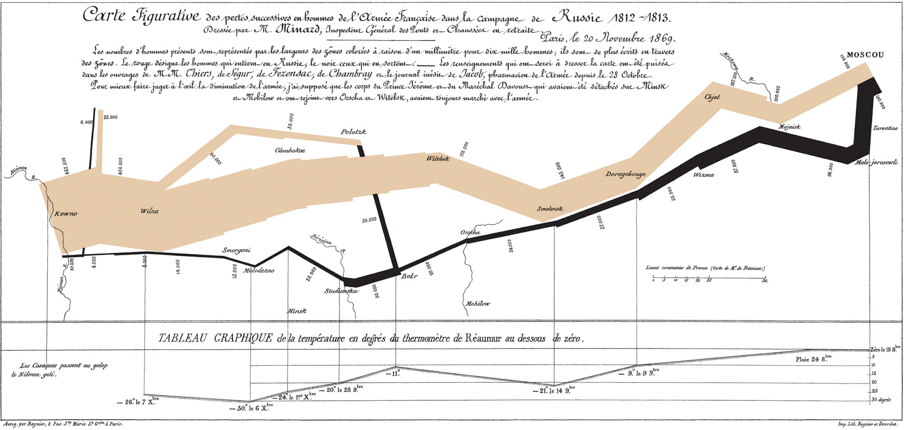
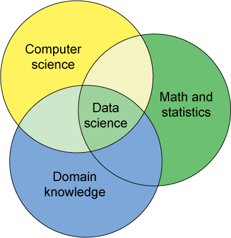

<style>
h2 { 
 color: #3399ff;		
}
h3 { 
 color: #3399ff;		
}
</style>

<div class="notes">
This is my *note*.
- It can contain markdown
- like this list
</div>

```{r, echo=FALSE}
suppressPackageStartupMessages(library(ggplot2))
suppressPackageStartupMessages(library(ggthemes))
suppressPackageStartupMessages(library(dplyr))
suppressPackageStartupMessages(library(tidyr))
suppressPackageStartupMessages(library(knitr))
suppressPackageStartupMessages(library(stringr))
suppressPackageStartupMessages(library(lubridate))
suppressPackageStartupMessages(library(Quandl))
suppressPackageStartupMessages(library(scales))
suppressPackageStartupMessages(library(rgdal))
Quandl.api_key("izVwTt9m5VoEe7TsEzdr")

# Paths to datasets
houston_data_path <- "~/Documents/Teaching/MATH216/HW/HW-1/data/"
okcupid_data_path <- "~/Documents/Teaching/MATH216/HW/HW-2/"
jukebox_data_path <- "~/Documents/Teaching/MATH216/HW/HW-3/data/"
```

# Background


## Myself

 - 
 - 
 - 
 - 
 - 


## Middlebury College

<center></center>


## Middlebury College

> - Small (2400 students) undergraduate only liberal arts college
> - Typical class size ~20 students
> - Stats within the math dept: 1.5 statisticians
> - No major/minor in stats
> - Courses:
    + Intro stats
    + Year-long 300-level prob & stats sequence
    + Applied/methods classes in other depts


## Outline of Talk

Various Data Science initiatives at Middlebury:

* Description of New MATH216 Intro to Data Science course
* Proposed Minor in Data Science
* ASA DataFest


# Intro to Data Science

## Course Structure

### Prereqs

Only intro stats and some exposure to R or any other programming language

### Syllabus

* 5 biweekly analyses
    + Submitted in [R Markdown](http://rmarkdown.rstudio.com/): **reproducible research**
    + Feedback delivered via GitHub
* Term project: both written report and 12 min presentation
* In-class participation


## Demographics

**14 students:**  6 Seniors, 6 Juniors, & 2 Sophomores  

Of which: 

* **Double majors**:
    + Environmental Sciences-Econ
    + Econ-Linguistics
    + CS-Econ
* **Singe majors**:
    + Economics x 4
    + Molecular Bio & Biochem x 3
    + International Politics and Econ, Neuroscience, Bio, CS


## Principles

> - Mixture of lab & lecture: students bring their own laptops to class.
> - Use real, messy, complex data.
> - Discussions in class
> - This class uses R, but **is not a class on R**. I try to teach things in a
**language agnostic** fashion: transferable ideas & concepts.
> - ["Minimizing prerequisites to research."](http://arxiv.org/abs/1507.05346),
quote by George Cobb.


## Environment: RStudio

<center></center>


## How to get students to learn R?

> - Key: Forget Base R
> - How? The Hadleyverse. <center></center>
> - In particular
    + `dplyr` package for data wrangling/manipulation
    + `ggplot2` package for data visualization


## dplyr Verbs

Data manipulation via the following **verbs** on tidy data. The command name is
the action we want to perform!

1. **`filter`**: keep observations matching criteria
2. **`summarise`**: reduce many values to one
3. **`mutate`**: create new variables from existing ones
4. **`arrange`**: reorder rows
5. **`select`**: pick columns by name
6. **`join`**: join two data sets
7. **`group_by`**: group subsets of observations together


## ggplot2: the Grammar of Graphics

<center>

&nbsp;&nbsp;&nbsp;&nbsp;&nbsp;

</center>


## ggplot2: the Grammar of Graphics

A statistical graphic is a mapping of variables in a

* **`data`** set to 
* **`aes()`**thetic attributies of 
* **`geom_`**etric objects.

`ggplot2` allows us to construct graphics in a modular fashion by specifying these components.


## ggplot2: the Grammar of Graphics

<center></center>


## ggplot2: the Grammar of Graphics

6 dimensions  of information on a 2 dimensional page:

`data` | `aes()`  | `geom_`
------------- | ------------- | -------------
longitude | `x` | `point` 
latitude | `y` | `point` 
army size | `size` | `path`
forward vs retreat | `color` | `path`
date | `x, y` | `text`
temperature | `x, y` | `line`


# Example Analyses

## Dataset: Houston Flights

```{r, warning=FALSE, message=FALSE, echo=FALSE, cache=TRUE}
flights <-
  read.csv(paste(houston_data_path, "flights.csv", sep=""), stringsAsFactors = FALSE) %>%
  tbl_df() %>%
  mutate(date=as.Date(date))
weather <-
  read.csv(paste(houston_data_path, "weather.csv", sep=""), stringsAsFactors = FALSE) %>%
  tbl_df() %>%
  mutate(date=as.Date(date))
planes <-
  read.csv(paste(houston_data_path, "planes.csv", sep=""), stringsAsFactors = FALSE) %>%
  tbl_df()
airports <-
  read.csv(paste(houston_data_path, "airports.csv", sep=""), stringsAsFactors = FALSE) %>%
  tbl_df()
states <-
  read.csv(paste(houston_data_path, "states.csv", sep=""), stringsAsFactors = FALSE) %>%
  tbl_df()
```

Domestic flights leaving Houston airport (IAH) in 2011.  Four data sets:

* `flights`:  info on all `r formatC(nrow(flights), format="d", big.mark=',')` flights
* `weather`:  hourly weather info
* `planes`:  information on all `r nrow(planes)` airplanes
* `airports`:  information on all `r nrow(airports)` destination airports


## Delayed Flights

```{r, warning=FALSE, message=FALSE, echo=FALSE, cache=TRUE}
flight_delays <- flights %>%
  select(date, dep_delay) %>%
  group_by(date)
flight_delays30 <- filter(flight_delays, dep_delay > 30) %>%
  count(date)

ggplot(data=flight_delays30, aes(x=date, y=n)) +
  geom_line(stat="identity") +
  xlab("Date") +
  ylab("Proportion of Flights Delayed longer than 30 minutes") +
  ggtitle("Departure Delays from Houston over a Year") +
  theme_economist() +
  geom_smooth(col="blue")
```


## Age of Airplanes

```{r, warning=FALSE, message=FALSE, echo=FALSE, cache=TRUE}
airline_plane_ages <-
  flights %>%
  left_join(planes, by='plane') %>%
  select(carrier, plane, year) %>%
  filter(!(is.na(year)) & plane != '') %>%
  mutate(age = 2011 - year)

ggplot(airline_plane_ages, aes(x = reorder(carrier, age, FUN=median), y = age)) +
  geom_boxplot() +
  labs(title = "Ages of airplanes flown through Houston, TX in 2011 by carrier",
       x = "Carrier",
       y = "Age (2011 - Year of Airplane)") +
  coord_flip()
```


## Dataset: OkCupid Data

```{r, warning=FALSE, message=FALSE, echo=FALSE, cache=TRUE}
profiles <-
  read.csv(paste(okcupid_data_path, "profiles.csv", sep=""), header=TRUE) %>%
  tbl_df()
profiles <- select(profiles, -contains("essay"))
# Define a binary outcome variable: y_i = 1 if female
profiles <- profiles %>%
  mutate(
    last_online = as.Date(str_sub(last_online, 1, 10)),
    is_female = ifelse(sex=="f", 1, 0)
    )
```

> - Sample of 10% of [San Francisco OkCupid users](https://github.com/rudeboybert/JSE_OkCupid)
in June 2012 ($n=`r nrow(profiles)`$)
> - `r round(100*mean(profiles$is_female), 1)`% of the sample was female  
> - Use logistic regression to predict gender
> - Overfitting, out-of-sample prediction, cross-validation


<!-- ## Height -->

<!-- ```{r, warning=FALSE, message=FALSE, echo=FALSE, cache=TRUE} -->
<!-- profiles <- mutate(profiles, is_female = ifelse(sex=="f", 1, 0)) -->
<!-- base_plot <- ggplot(data=profiles, aes(x=height, y=is_female)) + -->
<!--   scale_y_continuous(breaks=0:1) + -->
<!--   theme(panel.grid.minor.y = element_blank()) + -->
<!--   xlab("Height in inches") + -->
<!--   ylab("Is female?") -->
<!-- # -->
<!-- logistic.model <- glm(is_female ~ height, family=binomial, data=profiles) -->
<!-- b2 <- coefficients(logistic.model) -->
<!-- # -->
<!-- inverse.logit <- function(x, b){ -->
<!--   linear.equation <- b[1] + b[2]*x -->
<!--   1/(1+exp(-linear.equation)) -->
<!-- } -->
<!-- base_plot +  -->
<!--   geom_jitter(position = position_jitter(width = .2, height=.1)) + -->
<!--   stat_function(fun = inverse.logit, args=list(b=b2), color="blue", size=2) -->
<!-- ``` -->


## Self-Referenced Body Type

*Best predictors have distinct differences (in gender) in large segments of the population.*

```{r, warning=FALSE, message=FALSE, echo=FALSE, cache=TRUE}
ggplot(profiles, aes(body_type, fill = sex)) +
  geom_bar(position = "dodge") +
  theme(axis.text.x=element_text(angle=45, hjust=1)) +
  xlab("Body Type") +
  ylab("Count")
```


## Self-Referenced Body Type

Need to normalize to compare proportions, not counts!

```{r, warning=FALSE, message=FALSE, echo=FALSE, cache=TRUE}
sex_counts <- profiles %>% 
  group_by(sex) %>% 
  tally()

counts <- profiles %>% 
  select(sex, body_type) %>% 
  group_by(sex, body_type) %>% 
  tally() %>% 
  inner_join(sex_counts, by="sex") %>% 
  mutate(prop=n.x/n.y) %>% 
  select(sex, body_type, prop)

ggplot(counts, aes(x=body_type, y=prop, fill = sex)) +
  geom_bar(stat="identity", position = "dodge") +
  theme(axis.text.x=element_text(angle=45, hjust=1)) +
  xlab("Body Type") +
  ylab("Proportion")
```


## Dataset: Reed College Jukebox

```{r, warning=FALSE, message=FALSE, echo=FALSE, cache=TRUE}
jukebox <- read.csv(paste(jukebox_data_path, "jukebox.csv", sep=""), header=TRUE) %>% 
  tbl_df()
```

All `r formatC(nrow(jukebox), format="d", big.mark=',')` songs played on the
Reed College pool hall room jukebox from 2003-2009.

```{r, warning=FALSE, message=FALSE, echo=FALSE}
slice(jukebox, 1110:1112) %>% kable()
```


## Importance of EDA

```{r, warning=FALSE, message=FALSE, echo=FALSE, cache=TRUE}
jukebox <- jukebox %>%
  mutate(date_time = parse_date_time(date_time, "%b %d %H%M%S %Y"))

jukebox %>%
  mutate(hour=hour(date_time)) %>%
  group_by(hour) %>%
  summarise(count=n()) %>%
  ggplot(data=., aes(x=hour, y=count)) + geom_bar(stat="identity") +
  xlab("Hour of day") + ylab("Number of songs played")
```


## Importance of EDA

```{r, warning=FALSE, message=FALSE, echo=FALSE, cache=TRUE}
jukebox <- jukebox %>%
  mutate(
    date_time = with_tz(date_time, tz = "America/Los_Angeles"),
    week = ceiling_date(date_time, "week"),
    month = ceiling_date(date_time, "month")
  )

jukebox %>%
  mutate(hour=hour(date_time)) %>%
  group_by(hour) %>%
  summarise(count=n()) %>%
  ggplot(data=., aes(x=hour, y=count)) + geom_bar(stat="identity") +
  xlab("Hour of day") + ylab("Number of songs played")
```


## Time Series

[quandl.com](https://www.quandl.com/) has a great R interface

```{r, echo=FALSE, message=FALSE, warning=FALSE}
# Get bitcoin differences
bitcoin <- Quandl("BAVERAGE/USD", start_date="2013-01-01") %>% 
  tbl_df() %>% 
  mutate(Date=ymd(Date)) %>%
  rename(price = `24h Average`) %>% 
  select(Date, price) %>%
  arrange(Date) %>% 
  mutate(
    lag.price = lag(price),
    rel.diff = (price-lag.price)/lag.price,
    type = "Bitcoin"
    ) %>%
  select(Date, rel.diff, type)

# Get gold differences
gold <- Quandl("BUNDESBANK/BBK01_WT5511", start_date="2013-01-01") %>% 
  tbl_df() %>% 
  mutate(Date=ymd(Date)) %>%
  rename(price=Value) %>% 
  arrange(Date) %>% 
  mutate(
    lag.price = lag(price),
    rel.diff = (price-lag.price)/lag.price,
    type = "Gold"
    ) %>%
  select(Date, rel.diff, type)

ggplot(data=NULL, aes(x=Date, y=rel.diff)) + 
  geom_line(data=bitcoin, col="black") + 
  geom_line(data=gold, col="gold") + 
  scale_y_continuous(labels = percent) + 
  labs(y="Day-Over-Day Relative % Change", 
       title="Volatility of Bitcoin and Gold Prices")
```


## Maps

```{r, echo=FALSE, message=FALSE, warning=FALSE, cache=TRUE}
clean.text <- function(text){
  text <- gsub("[^[:alnum:]]", "", text)
  text <- gsub(" ", "", text)
  text <- tolower(text)
  return(text)
}

# State and county map of US in 2010
US_state <- map_data("state") %>% tbl_df()
US_county <- map_data("county") %>% tbl_df()

US_state <- US_state %>%
  mutate(region=clean.text(region))
US_county <- US_county %>%
  mutate(
    region=clean.text(region),
    subregion=clean.text(subregion)
  ) %>%
  unite("county", c(region, subregion), sep="-", remove=FALSE)

# Load elections data, get county summaries, then state summaries
elections.county <-
  read.csv("data/COUNTY.csv", header=TRUE, stringsAsFactors=FALSE) %>%
  tbl_df() %>%
  mutate(
    STATE=clean.text(STATE),
    COUNTY=clean.text(COUNTY)
    ) %>%
  unite("county", c(STATE, COUNTY), sep="-", remove=FALSE) %>%
  select(county, STATE, COUNTY, BUSH, GORE) %>%
  mutate(
    N = BUSH + GORE,
    PBUSH = BUSH/N,
    PGORE = GORE/N
    )
elections.state <- elections.county %>%
  group_by(STATE) %>%
  summarise(BUSH=sum(BUSH), GORE=sum(GORE), N=sum(N)) %>%
    mutate(
    PBUSH = BUSH/N,
    PGORE = GORE/N
    )

# Join the maps with the election counts.
US_county <- inner_join(US_county, elections.county, by="county")
US_state <- inner_join(US_state, elections.state, by=c("region" = "STATE"))
```

```{r, echo=FALSE, warning=FALSE, message=FALSE, cache=TRUE}
ggplot(data=NULL) +
  geom_polygon(data=US_county, aes(x=long, y=lat, group=group, fill=100*(PBUSH-0.50))) +
  geom_path(data=US_county, aes(x=long, y=lat, group=group), col="black", size=0.05) +
  geom_path(data=US_state, aes(x=long, y=lat, group=group), col="black", size=0.1) +
  coord_map() +
  scale_fill_gradient2(name="", low="blue", high="red", mid="white") +
  ggtitle("2000 US Elections: Bush vs Gore")
```


## Interactivity

Two R packages for interactivity:

* [Shiny](http://shiny.rstudio.com/): A web application framework for creating 
interactive web applications with no HTML, CSS, or JavaScript knowledge required.
* [Leaflet](https://rstudio.github.io/leaflet/): Embed maps into OpenStreetMaps

Example on Middlebury Shiny Server Pro: [VT Census Tracts](https://shiny.middlebury.edu:3838/aykim/VT/).


# Proposed Data Science Minor

## What is Data Science?

<center></center>


## Proposed Minor

* Targeted at students in a field where facility with data is a valued skill, but not MATH and CS majors.
* Courses
    + 3 computer science
    + 2 stats
    + 2 **domain courses** in bio, econ, psych, chem, physics, political science, etc.
* Full details are [here](https://docs.google.com/document/d/1fW0wcorT-gCTRoDY5sNM86E6QJLdyLMAuN3erA1fNws/edit)


# DataFest

## DataFest

 

[DataFest](http://rudeboybert.github.io/pages/teaching/datafest/datafest.html)
is an internationally coordinated undergraduate data science hackathon run by
the ASA.

Biggest ones:

* [UCLA](http://datafest.stat.ucla.edu/)
* [Duke](http://www2.stat.duke.edu/datafest/)
* [5 Colleges](http://www.science.smith.edu/datafest/) in Western MA


## DataFest

<center></center>


## DataFest

Prof. Philip Yates at Saint Michael's College and I organized the first
inaugural [DataFest Vermont
802](http://rudeboybert.github.io/pages/teaching/datafest/datafest.html) the
weekend of April 8th-10th at Saint Michael's College.

<center><center>


## Example Work


# Some Thoughts

## Data Visualization

> - **Data visualization is a gateway drug to statistics.**
> - Prez from Season 4 of "The Wire":
> - <center></center>
> - Students got really excited by ggplot, maps, and Shiny apps.


## Pedagogical Issue: Programming

It's like learning a language. Frustration!

> - Point-and-click vs command line.  
> - Thinking algorithmically
> - Debugging: help files and [Google](https://imgs.xkcd.com/comics/tech_support_cheat_sheet.png)
> - Hadley's [wisdom](https://twitter.com/hadleywickham/status/589068687669243905?lang=en)


## Learning to Code

> - Learning in class should reflect **how we learn in real life**
> - Experimenting with an **open-learning** format: students can collaborate completely
and see each other's work. Still haven't decided on its merits.
> - However, new tools like [Datacamp](https://www.datacamp.com/) are increasing the ratio: $$\frac{\mbox{Payoff from learning R}}{\mbox{Startup costs}}$$


## Importance of Feedback

> - Developing skills and intuition takes time.  At Middlebury classes are
small: attention and good feedback can be given.
> - Feedback via GitHub: they won't learn Git, rather just use it. [GUI for feedback delivery](https://github.com/Middlebury-Data-Science/HW-2/pull/10/files).
> - Like giving feedback on a paper: more art than science.


## Resources

* Slides: [bit.ly/DataScienceBTV](http://bit.ly/DataScienceBTV)
* [GitHub Organization](https://github.com/Middlebury-Data-Science) for this class 