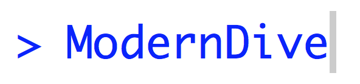
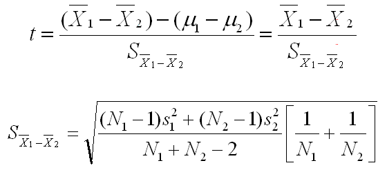

<style>
h1{font-weight: bold;}
h2{color: #3399ff;}
h3{color: #3399ff;}
slides slide.backdrop {background: white;}
</style>
<style type="text/css">
slides > slide:not(.nobackground):after {
  content: '';
}
</style>

```{r setup, include=FALSE}
knitr::opts_chunk$set(echo = FALSE, message = FALSE, warning = FALSE, fig.width=8, fig.height=4.5)
if(FALSE){
  # Run this to render slides as HTML document:
  rmarkdown::render("2017-05-17-USCOTS.Rmd", output_format = c("html_document"))
}
```

```{r, echo=FALSE, message=FALSE}
library(tidyverse)
library(mosaic)
library(stringr)
library(okcupiddata)
library(knitr)
```

<!----------------------------------------------------------------------------->
# Introduction

## Outline of Workshop

* 


## Our Textbook



* *An Introduction to Statistical and Data Sciences via R*
* Webpage: <http://moderndive.com>. [GitHub Repo](https://github.com/ismayc/moderndiver-book)


## ModernDive and Our Syllabi

> * ModernDive's guiding philosophies are deeply intertwined our syllabi
> * Hard to speak of ModernDive in isolation from syllabi and vice-versa
> * Numbers are numbers, but data has context...


<!----------------------------------------------------------------------------->
# Context & Background

## Albert's Course

* Introduction to Statistical & Data Sciences: [Webpage](https://rudeboybert.github.io/MATH116/) and [GitHub Repo](https://github.com/rudeboybert/MATH116)
* Administrative:
    + Chief non-econ/bio stats service class at Middlebury
    + 12 weeks each with 3h "lecture" + 1h "lab"
* Students:
    + ~24 students/section of all years/backgrounds. Only stats class many will take
    + Background: Many had AP stats, some with programming
    + All had laptops that they brought everyday


## Albert's Syllabus

* [Topic List](https://rudeboybert.github.io/MATH116/)
    + **First half is data science**: data visualization, manipulation, importing
    + **Second half is intro stats**: sampling, hypothesis tests, CI, regression
* Evaluation
    + 10%: weekly problem sets
    + 10%: engagement
    + 45%: 3 midterms (last during finals week)
    + **35%: [Final projects](https://rudeboybert.github.io/MATH116/PS/final_project/final_project_outline.html#learning_goals)**


## Albert's Typical Classtime

* First 10-15min: Priming topic, either via slides or **chalk talk**
* Remainder: Students read over text & do **Learning Checks** in groups and without direct instructor guidance. 

<center></center>


## Chester: Social Statistics 

* 


## What is Different?

What are we doing that's different and why?

1. Data first! Start with data science via `tidyverse`, then stats.
1. Replacing the **mathematical/analytic** with **computational/simulation-based** whenever possible.
1. The above necessitates algorithmic thinking, computational logic and some coding/programming.
1. Complete reproducibility


## 1) Data First!

Actual dialogue I had with a student:


## 1) Data First!

Cobb ([TAS 2015](https://arxiv.org/abs/1507.05346)): *Minimizing prerequisites to research*. In other words, focus on entirety of Wickham/Grolemund's pipeline...


## 1) Data First!

... and not just this part. 


## 1) Data First!

Furthermore use data science tools **that a data scientist would use**. Example: [`tidyverse`](http://tidyverse.org/)

<center></center>


## 1) Data First!

What does this buy us?

* Context for asking scientific questions
* Look at data that's rich, real, and realistic. Examples: Data packages such as [`nycflights13`](https://github.com/hadley/nycflights13) and [`fivethirtyeight`](https://cran.r-project.org/web/packages/fivethirtyeight/vignettes/fivethirtyeight.html)
* Better motivate traditional statistical topics


## 2) Computers, Not Math!

Cobb ([TAS 2015](https://arxiv.org/abs/1507.05346)): Two possible "computational
engines" for statistics, in particular relating to sampling:

> * Mathematics: formulas, probability theory, large-sample approximations, central limit theorem
> * Computers: simulations, resampling methods


## 2) Computers, Not Math!

We present students with a choice for our "engine":

Either we use this...            |  Or we use this...
:-------------------------:|:-------------------------:
   |   

<br>

> * Almost all are thrilled to do latter
> * Leave "bread crumbs" for more advanced math/stats courses


## 2) Computers, Not Math!

What does this buy us?

* Emphasizes: stats is not math, rather stats uses math.
* Simulations are more tactile
* Reducing probability and march to CLT, this frees up space in syllabus.


## 3) Algorithms, Computation, & Coding

* Both "Data First!" and "Computers, Not Math!" necessitate algorithmic thinking, computational logic and some coding/programming.
* Battle is more psychological than anything:
    + "This is not a class on programming!"
    + "Computers are stupid!"
    + "Learning to code is like learning a foreign language!"
    + "Early on don't code from scratch! Take something else that's similar and tweak it!"
    + Learning how to Google effectively


## 3) Algorithms, Computation, & Coding

Why should we do this?

* Data science and machine learning.
* Where statistics is heading. Gelman [blog post](http://andrewgelman.com/2017/05/14/computer-programming-prerequisite-learning-statistics/).
* Many new tools, like DataCamp, allow us to outsource many less interesting topics to teach.
* Bigger picture:
    + Coding is becoming a basic skill like reading and writing.
    + Data analysis, as opposed to algorithms and data structures, could attract more students from traditionally underrepresented groups.


## 4) Complete Reproducibility

* Students learn best when they can take can apart a toy (analysis) and then rebuild it (synthesis).
* Crisis in Reproducibility
* Ultimately the best textbook is one you've written yourself.
    + Everyone has different contexts, backgrounds, needs
    + Hard to find one-size-fits-all solutions
* A new paradigm in textbooks? [Versions, not editions?](https://twitter.com/rudeboybert/status/820032345759592448)


## Let's Dive In!

Insert appropriate image


<!----------------------------------------------------------------------------->
# Getting Started

## R

* Chester's Book: Ask how he wants it pitched
* DataCamp: Intro to R


## RStudio vs RStudio Server


