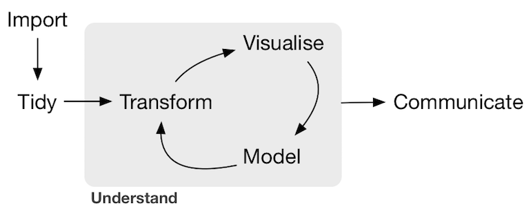

<style>
h1{font-weight: bold;}
h2{color: #3399ff;}
h3{color: #3399ff;}
slides slide.backdrop {background: white;}
</style>
<style type="text/css">
slides > slide:not(.nobackground):after {
  content: '';
}
</style>

```{r setup, include=FALSE}
knitr::opts_chunk$set(message = FALSE, warning = FALSE, fig.width=8, fig.height=4.5)
if(FALSE){
  # Run this to render slides as HTML document:
  rmarkdown::render("2017-05-17-USCOTS.Rmd", output_format = c("html_document"))
}
```

```{r, echo=FALSE, message=FALSE}
library(tidyverse)
library(mosaic)
library(stringr)
library(okcupiddata)
library(knitr)
```

<!----------------------------------------------------------------------------->
# Introduction

## Who We Are

* [Chester Ismay](https://ismayc.github.io/): Reed College & Pacific University
    + Email: 
    + GitHub: [`ismayc`](https://github.com/ismayc)
    + Twitter: [`@old_man_chester`](https://twitter.com/old_man_chester)
* [Albert Y. Kim](http://rudeboybert.github.io/): Middlebury College
    + Email: <albert.ys.kim@gmail.com>
    + GitHub: [`rudeboybert`](https://github.com/rudeboybert)
    + Twitter: [`@rudeboybert`](https://twitter.com/rudeboybert)


## Outline of Workshop

LINK TO DOCUMENT


## Our Textbook


* *An Introduction to Statistical and Data Sciences via R*
* Webpage: <http://moderndive.com>. [GitHub Repo](https://github.com/ismayc/moderndiver-book)
* In you haven't already, please [signup](http://moderndive.us15.list-manage2.com/subscribe?u=87888fab720da90906427a5be&id=0c9e2d1df2) for our mailing list!


## ModernDive and Our Syllabi

> * ModernDive's guiding philosophies are deeply intertwined our syllabi
> * Hard to speak of ModernDive in isolation from syllabi and vice-versa
> * Numbers are numbers, but data has context...


## Albert's Course

* Introduction to Statistical & Data Sciences: [Webpage](https://rudeboybert.github.io/MATH116/) and [GitHub Repo](https://github.com/rudeboybert/MATH116)
* Administrative:
    + Chief non-econ/bio stats service class at Middlebury
    + 12 weeks each with 3h "lecture" + 1h "lab"
    + **No prerequisites**
* Students:
    + ~24 students/section of all years/backgrounds. Only stats class many will take
    + Background: Many had AP stats, some with programming
    + All had laptops that they brought everyday


## Albert's Syllabus

* [Topic List](https://rudeboybert.github.io/MATH116/)
    + **First half is data science**: data visualization, manipulation, importing
    + **Second half is intro stats**: sampling, hypothesis tests, CI, regression
* Evaluation
    + 10%: weekly problem sets
    + 10%: engagement
    + 45%: 3 midterms (last during finals week)
    + **35%: [Final projects](https://rudeboybert.github.io/MATH116/PS/final_project/final_project_outline.html#learning_goals)**


## Albert's Typical Classtime

* First 10-15min: Priming topic, either via slides or **chalk talk**
* Remainder: Students read over text & do **Learning Checks** in groups and without direct instructor guidance. 

<center></center>


## Chester: Social Statistics 

* 


## What Are We Doing And Why?

1. Data first! Start with data science via `tidyverse`, then stats.
1. Replacing the **mathematical/analytic** with **computational/simulation-based** whenever possible.
1. The above necessitates algorithmic thinking, computational logic and some coding/programming.
1. Complete reproducibility


<!--
## 1) Data First!

Actual dialogue I had with a student:


-->


## 1) Data First!

Cobb ([TAS 2015](https://arxiv.org/abs/1507.05346)): *Minimizing prerequisites to research*. In other words, focus on entirety of Wickham/Grolemund's pipeline...




## 1) Data First!

... and not just this part. 


## 1) Data First!

Furthermore use data science tools **that a data scientist would use**. Example: [`tidyverse`](http://tidyverse.org/)

<center></center>


## 1) Data First!

What does this buy us?

* Students can do effective data-story telling
* Context for asking scientific questions
* Look at data that's rich, real, and realistic. Examples: Data packages such as [`nycflights13`](https://github.com/hadley/nycflights13) and [`fivethirtyeight`](https://cran.r-project.org/web/packages/fivethirtyeight/vignettes/fivethirtyeight.html)
* Better motivate traditional statistical topics


## 2) Computers, Not Math!

Cobb ([TAS 2015](https://arxiv.org/abs/1507.05346)): Two possible "computational
engines" for statistics, in particular relating to sampling:

> * Mathematics: formulas, probability theory, large-sample approximations, central limit theorem
> * Computers: simulations, resampling methods


## 2) Computers, Not Math!

We present students with a choice for our "engine":

Either we use this...            |  Or we use this...
:-------------------------:|:-------------------------:
   |   

<br>

> * Almost all are thrilled to do latter
> * Leave "bread crumbs" for more advanced math/stats courses


## 2) Computers, Not Math!

What does this buy us?

* Emphasizes: stats is not math, rather stats uses math.
* Simulations are more tactile
* Reducing probability and march to CLT, this frees up space in syllabus.


## 3) Algorithms, Computation, & Coding

* Both "Data First!" and "Computers, Not Math!" necessitate algorithmic thinking, computational logic and some coding/programming.
* Battle is more psychological than anything:
    + "This is not a class on programming!"
    + "Computers are stupid!"
    + "Learning to code is like learning a foreign language!"
    + "Early on don't code from scratch! Take something else that's similar and tweak it!"
    + Learning how to Google effectively


## 3) Algorithms, Computation, & Coding

Why should we do this?

* Data science and machine learning.
* Where statistics is heading. Gelman [blog post](http://andrewgelman.com/2017/05/14/computer-programming-prerequisite-learning-statistics/).
* Many new tools, like DataCamp, allow us to outsource many less interesting topics to teach.
* We are doing a disservice to students by shielding them from these ideas.
* Bigger picture:
    + Coding is becoming a basic skill like reading and writing.
    + Data analysis, as opposed to algorithms and data structures, could attract more students from traditionally underrepresented groups.


## 4) Complete Reproducibility

* Students learn best when they can take can apart a toy (analysis) and then rebuild it (synthesis).
* Crisis in Reproducibility
* Ultimately the best textbook is one you've written yourself.
    + Everyone has different contexts, backgrounds, needs
    + Hard to find one-size-fits-all solutions
* A new paradigm in textbooks? [Versions, not editions?](https://twitter.com/rudeboybert/status/820032345759592448)


## Let's Dive In!

Insert appropriate image


<!----------------------------------------------------------------------------->
# Getting Started

## DataCamp

DataCamp offers an interactive, browser based tool for learning R/Python. Their
two flagship R courses, both of which are free:

* [Intro to R](https://www.datacamp.com/courses/free-introduction-to-r) 
* [Intermediate R](https://www.datacamp.com/courses/intermediate-r-practice) courses


## DataCamp

Outsource many essential but not fun to teach topics like

* Idea of command-line vs point-and-click
* Syntax: Variable names typed exactly, parentheses matching
* Algorithmic Thinking: Linearity of code, object assignment
* Computational Logic: boolean algebra, conditional statements, functions


## DataCamp Pros

* Can assign "Intro to R" very first day of class as "Homework 0"
* Outsourcing allows you to free up class time
* With their [free academic license](https://www.datacamp.com/groups/education), you can
    + Form class "Groups" and assign/track progress of courses
    + Have access to ALL [their courses](https://www.datacamp.com/courses), including `ggplot2`, `dplyr`, `RMarkdown`, and RStudio IDE.


## DataCamp Cons

* Some students will still have trouble; you can identify them however.
* The topics in these two courses may not align with your syllabus. You can assign at chapter level instead of course level


## DataCamp Conclusion

* Not a good tool for quick retention, but for introduction and subsequent repetition.
* [Feedback](https://docs.google.com/spreadsheets/d/1qUwt-v-xAQJ-1OTzMI2Q27McXG_3yXO5Qe9p-jz6BA8/edit) from students was positive.
* Battle is more psychological than anything. DataCamp reinforces to students that
    + "Computers are stupid!"
    + "Learning to code is like learning a foreign language!"


## Chester's First Bookdown Project

[Getting used to R, RStudio, and R Markdown](https://ismayc.github.io/rbasics-book/)


<!----------------------------------------------------------------------------->
# Inference

## Chapter 6: Sampling Highlights

## Chapter 7: Hypothesis Testing Highlights

## Chapter 8: Confidence Intervals Highlights


## Chapter 9: Regression Highlights

1. Experience with `ggplot2` package and knowledge of the Grammar of Graphics primes students for regression
1. Use of the `broom` package to unpack regression


## 1. `ggplot2` Primes Regression

* REPEAT WHATEVER PHRASE CHESTER USED TO SAY THAT GRAMMAR FOCUSES ON **RELATIONSHIPS**
BETWEEN VARIABLES
* This ultimately what regression is about!


## 1. `ggplot2` Primes Regression

Example:

* For all Alaskan Airlines and Frontier flights leaving NYC in 2013
* We want to study the relationship between temperature and departure delay
* For summer (June, July, August) and non-summer months separately

This involves four variables `carrier`, `temp`, `dep_delay`, `summer`

## 1. `ggplot2` Primes Regression

```{r, echo=FALSE}
library(ggplot2)
library(dplyr)
library(nycflights13)

flights_subset <- flights %>% 
  filter(carrier == "AS" | carrier == "F9") %>% 
  left_join(weather, by=c("year", "month", "day", "hour", "origin")) %>% 
  filter(dep_delay < 250) %>% 
  mutate(summer = ifelse(month == 6 | month == 7 | month == 8, "Summer Flights", "Non-Summer Flights"))

ggplot(data = flights_subset, mapping = aes(x = temp, y=dep_delay, col=carrier)) + 
  geom_point() +
  geom_smooth(method = "lm", se = FALSE) +
  facet_wrap(~summer)
```

## 1. `ggplot2` Primes Regression

Why? Dig deeper into data. Look at `origin` and `dest` variables as well:

```{r, echo=FALSE}
flights_subset %>% 
  group_by(carrier, origin, dest) %>% 
  summarise(`Number of Flights` = n()) %>% 
  kable(digits=3)
```


## 2. `broom` Package

* The `broom` package takes the messy output of built-in functions in R, such as
`lm`, `nls`, or `t.test`, and turns them into tidy data frames.
* Fits in with `tidyverse` ecosystem
* This works for [many R data types](https://github.com/tidyverse/broom#available-tidiers)!


## 2. `broom` Package

In our case, `broom` functions take `lm` objects as inputs and return the following in tidy format!

* `tidy()`: regression output table
* `augment()`: point-by-point values (fitted values, residuals, predicted values)
* `glance()`: scalar summaries like $R^2$, 


## 2. `broom` Package

The chapter will be built around this code:

```{r, eval=FALSE}
library(ggplot2)
library(dplyr)
library(nycflights13)
library(knitr)
library(broom)
set.seed(2017)

# Load Alaska data, deleting rows that have missing departure delay
# or arrival delay data
alaska_flights <- flights %>% 
  filter(carrier == "AS") %>% 
  filter(!is.na(dep_delay) & !is.na(arr_delay)) %>% 
  sample_n(50)
View(alaska_flights)


# Exploratory Data Analysis----------------------------------------------------
# Plot of sample of points:
ggplot(data = alaska_flights, mapping = aes(x = dep_delay, y = arr_delay)) + 
   geom_point()

# Correlation coefficient:
alaska_flights %>% 
  summarize(correl = cor(dep_delay, arr_delay))

# Add regression line
ggplot(data = alaska_flights, mapping = aes(x = dep_delay, y = arr_delay)) + 
  geom_point() +
  geom_smooth(method = "lm", se = FALSE, color = "red")


# Fit Regression and Study Output with broom Package---------------------------
# Fit regression
delay_fit <- lm(formula = arr_delay ~ dep_delay, data = alaska_flights)

# 1. broom::tidy() regression table with confidence intervals and no p-value stars
regression_table <- delay_fit %>% 
  tidy(conf.int=TRUE)
regression_table %>% 
  kable(digits=3)

# 2. broom::augment() for point-by-point values
regression_points <- delay_fit %>% 
  augment() %>% 
  select(arr_delay, dep_delay, .fitted, .resid) 
regression_points %>% 
  head() %>% 
  kable(digits=3)

# and for prediction
new_flights <- data_frame(dep_delay = c(25, 30, 15))
delay_fit %>% 
  augment(newdata = new_flights) %>% 
  kable()

# 3. broom::glance() scalar summaries of regression
regression_summaries <- delay_fit %>% 
  glance() 
regression_summaries %>% 
  kable(digits=3)


# Residual Analysis------------------------------------------------------------
ggplot(data = regression_points, mapping = aes(x = .resid)) +
  geom_histogram(binwidth=10) +
  geom_vline(xintercept = 0, color = "blue")
ggplot(data = regression_points, mapping = aes(x = .fitted, y = .resid)) +
  geom_point() +
  geom_abline(intercept = 0, slope = 0, color = "blue")
ggplot(data = regression_points, mapping = aes(sample = .resid)) +
  stat_qq()


# Preview of Multiple Regression-----------------------------------------------
flights_subset <- flights %>% 
  filter(carrier == "AS" | carrier == "F9") %>% 
  left_join(weather, by=c("year", "month", "day", "hour", "origin")) %>% 
  filter(dep_delay < 250) %>% 
  mutate(summer = ifelse(month == 6 | month == 7 | month == 8, "Summer Flights", "Non-Summer Flights"))

ggplot(data = flights_subset, mapping = aes(x = temp, y=dep_delay, col=carrier)) + 
  geom_point() +
  geom_smooth(method = "lm", se = FALSE) +
  facet_wrap(~summer)
```


<!----------------------------------------------------------------------------->
# The Future

## The Immediate Future

By July 1st, 2017

* Complete Development of Chapters 6-9 on Simulations, Hypothesis Testing, Confidence Intervals, and Regression
* Learning Checks: Discussion/solutions embedded directly in the textbook, that you can reveal progressively.
* Have better [data frame printing](http://rmarkdown.rstudio.com/html_document_format.html#data_frame_printing). Instead of raw R code use
    + Less jarring `knitr::kable()` output or
    + Interactive table outputs, to replicate RStudio's `View()` function.


## The Longer Term

* In Chapter 7: Regression
    + Add more on categorical predictors
    + Multiple regression
* 


<!----------------------------------------------------------------------------->


