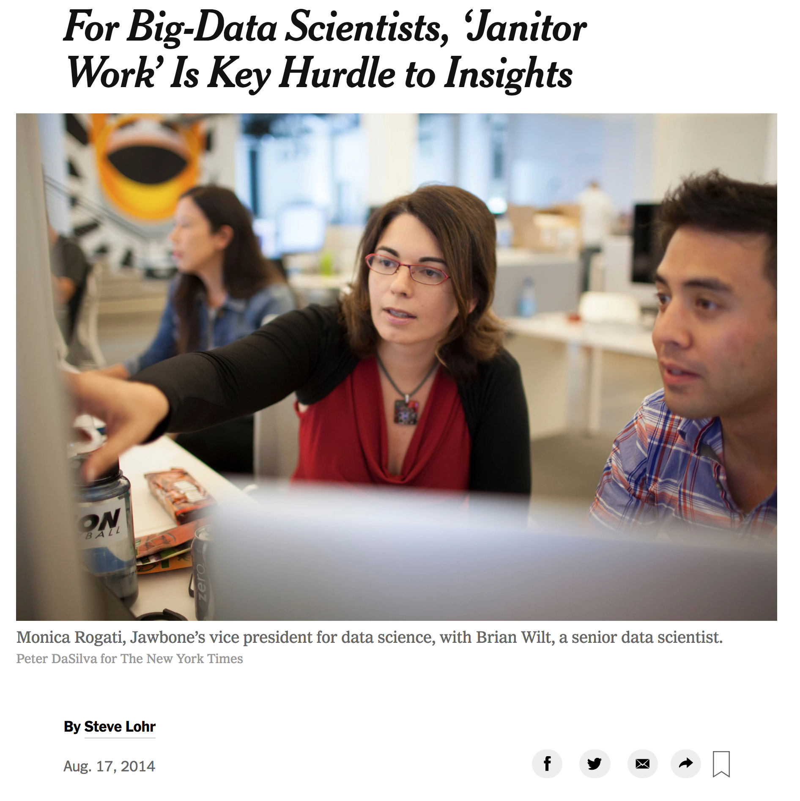

<style>
h1 { 
 color: #451675;		
}
h2 { 
 color: #451675;		
}
a:link {
  color: #451675;	
}
slides > slide.title-slide hgroup h1 {
  font-weight: bold;
  font-size: 35pt;
  color: #451675;
}
slides > slide.backdrop {
  background: white;
}

</style>

```{r setup, include=FALSE, purl=FALSE}
if(TRUE){
  knitr::opts_chunk$set(echo = TRUE, eval = TRUE, message = FALSE, warning = FALSE)
  suppressPackageStartupMessages(library(tidyverse))
  library(fivethirtyeight)
  library(patchwork)
  set.seed(76)
} else {
  knitr::opts_chunk$set(echo = TRUE, eval = TRUE)
  knitr::purl("eCOTS.Rmd", documentation = 0)
}
```

## Today's focus

What data to use in introductory statistics and data science courses? 

Ideally data that's:

> 1. **Rich** enough to answer meaningful questions with
> 1. **Real** enough to ensure that there is context
> 1. **Realistic** enough to convey to the reality of much of the world's data 


## One goal

On the one hand, [Cobb (2015)](https://arxiv.org/pdf/1507.05346.pdf) argues that 
we should

> 1. "Teach through research"
> 1. **"Minimize prerequisites to research"**


## Another goal

On the other hand, from [New York Times](https://www.nytimes.com/2014/08/18/technology/for-big-data-scientists-hurdle-to-insights-is-janitor-work.html): 

<center>

</center>


## Analogy for second goal

<center>
<blockquote class="twitter-tweet" data-lang="en"><p lang="en" dir="ltr">love <a href="https://twitter.com/JennyBryan?ref_src=twsrc%5Etfw">@JennyBryan</a>&#39;s analogy of classroom data as teddybears &amp; real data like a grizzly bear with salmon blood dripping out its mouth <a href="https://twitter.com/hashtag/jsm2015?src=hash&amp;ref_src=twsrc%5Etfw">#jsm2015</a></p>&mdash; sandy griffith (@sgrifter) <a href="https://twitter.com/sgrifter/status/631150829165113344?ref_src=twsrc%5Etfw">August 11, 2015</a></blockquote>
<script async src="https://platform.twitter.com/widgets.js" charset="utf-8"></script>
</center>


## Two conflicting goals

* On the one hand: Minimize prerequisites to research
* On the other: Do not betray reality of data as it exists in much of the world


## Back to analogy

In other words, a balancing act is required between:

Data with no prerequisites needed | Data as it exists "in the wild"  
:-------------------------:|:-------------------------:
 | 


## Data "taming"

Data "taming" sets out to balance:

* On the one hand: Performing enough pre-processing so that data is accessible to R novices
* On the other: Not performing so much pre-processing as to betray the reality of data as it exists "in the wild"

<!--
## Data petting zoo first

<center>
<blockquote class="twitter-tweet" data-conversation="none" data-lang="en"><p lang="en" dir="ltr">Data petting zoo first 1/2 <a href="https://t.co/sUn0njhhSO">pic.twitter.com/sUn0njhhSO</a></p>&mdash; Albert Y. Kim (@rudeboybert) <a href="https://twitter.com/rudeboybert/status/969249403939811330?ref_src=twsrc%5Etfw">March 1, 2018</a></blockquote>
<script async src="https://platform.twitter.com/widgets.js" charset="utf-8"></script>
</center>


## Data "in the wild" later

<center>
<blockquote class="twitter-tweet" data-conversation="none" data-lang="en"><p lang="en" dir="ltr">Then data in the wild! 2/2 <a href="https://t.co/Me5QXUS1iH">pic.twitter.com/Me5QXUS1iH</a></p>&mdash; Albert Y. Kim (@rudeboybert) <a href="https://twitter.com/rudeboybert/status/969249705850036225?ref_src=twsrc%5Etfw">March 1, 2018</a></blockquote>
<script async src="https://platform.twitter.com/widgets.js" charset="utf-8"></script>
</center>
-->


## "Tame" data principles

We propose the following <a target="_blank" class="page-link" href="http://rpubs.com/rudeboybert/fivethirtyeight_tamedata">"tame" data principles</a> to remove biggest hurdles R novices face:

> 1. Clean variable names
> 1. Identification variables in left-hand columns
> 1. Clean dates
> 1. Logically ordered categorical variables 
> 1. Consistent "tidy" format


## fivethirtyeight package

In the `fivethirtyeight` R package, [Chester Ismay](https://twitter.com/old_man_chester), [Jennifer Chunn](https://twitter.com/jchunn206), and I:

> * Take FiveThirtyEight's raw article data from <a target="_blank" class="page-link" href="https://github.com/fivethirtyeight/data">GitHub</a>
> * **Pre-process the raw data so that it follows "tame" data principles**
> * Make the tame data, documentation, and original article easily accessible via an R package


## Examples

Following examples involve code, so I suggest you follow in HTML version of slides:

1. In your browser, go to <a target="_blank" class="page-link" href="http://bit.ly/causeweb_tame">bit.ly/causeweb_tame</a>
1. In the left-hand menu, click on "Principle 1: Clean variable names"


## Principle 1: Clean variable names

### a) Comparing raw and tamed data

* Original article: [41 Percent Of Fliers Think You're Rude If You Recline Your Seat](https://fivethirtyeight.com/features/airplane-etiquette-recline-seat/)
* Raw CSV data: [`flying-etiquette.csv`](https://github.com/fivethirtyeight/data/blob/master/flying-etiquette-survey/)

```{r}
library(readr)
library(fivethirtyeight)

# Raw data: variable names are unwieldy & have spaces
flying_raw <- read_csv("https://raw.githubusercontent.com/fivethirtyeight/data/master/flying-etiquette-survey/flying-etiquette.csv")
colnames(flying_raw)[c(5, 19)]

# Tamed data: corresponding variable names are cleaner
colnames(flying)[c(5, 18)]
```

### b) Why should we care?

Working with variables names that are long/unwieldy and have spaces is a tricky.

```{r, eval=FALSE}
mosaicplot(~ `Do you have any children under 18?` + `In general, is itrude to bring a baby on a plane?`, 
           data = flying_raw,  main = "Raw data",
           xlab = "Have a baby?", ylab = "Is it rude?")
mosaicplot(~ children_under_18 + baby,
           data = flying,  main = "Tamed data",
           xlab = "Have a baby?", ylab = "Is it rude?")
```
```{r, echo=FALSE, fig.width=16/1.4, fig.height=9/1.4}
par(mfrow = c(1,2))
mosaicplot(~ `Do you have any children under 18?` + `In general, is itrude to bring a baby on a plane?`, data = flying_raw, xlab = "Have a baby?", ylab = "Is it rude?", main = "Raw data")
mosaicplot(~ children_under_18 + baby, data = flying, xlab = "Have a baby?", ylab = "Is it rude?", main = "Tamed data")
```


## Principle 2: ID variables

More organizational. Any identification variables that uniquely identify the observations/rows should be place in the left-hand columns since they are of highest prominence. Such variables are used to key joins/merging of datasets. 

* Original articles:
    1. [Straight Outta Compton' Is The Rare Biopic Not About White Dudes](https://fivethirtyeight.com/features/straight-outta-compton-is-the-rare-biopic-not-about-white-dudes/)
    1. [A Statistical Analysis of the Work of Bob Ross](https://fivethirtyeight.com/features/a-statistical-analysis-of-the-work-of-bob-ross/)
* Raw CSV data:
    1. [`biopics.csv`](https://github.com/fivethirtyeight/data/tree/master/biopics)
    1. [`elements-by-episode.csv`](https://github.com/fivethirtyeight/data/tree/master/bob-ross)

```{r}
library(fivethirtyeight)

# Both title and imdb site tag uniquely identify movies. Show only 8 first
# columns and 3 first rows of dataset:
biopics[1:3, 1:8]

# episode variable uniquely identifies episodes of "The Joy of Painting". Show
# only 8 first columns and 3 randomly chosen rows of dataset using dplyr package
library(dplyr)
bob_ross %>% 
  select(1:8) %>% 
  sample_n(3)
```


## Principle 3: Dates

### a) Comparing raw and tamed data

* Original article: [Some People Are Too Superstitious To Have A Baby On Friday The 13th](https://fivethirtyeight.com/features/some-people-are-too-superstitious-to-have-a-baby-on-friday-the-13th/)
* Raw CSV data: [`US_births_1994-2003_CDC_NCHS.csv`](https://github.com/fivethirtyeight/data/blob/master/births/)

```{r}
library(readr)
library(dplyr)
library(fivethirtyeight)

# Raw data: year, month, day are separate variables
US_births_1994_2003_raw <- read_csv("https://raw.githubusercontent.com/fivethirtyeight/data/master/births/US_births_1994-2003_CDC_NCHS.csv")
head(US_births_1994_2003_raw)

# Tamed data: variable date of type "date" included
head(US_births_1994_2003)
```

### b) Why should we care?

Without a variable of type `date`, making *time series* plots is difficult. 

```{r}
# Use filter command from dplyr package for data wrangling
US_births_1999 <- US_births_1994_2003 %>%
  filter(year == 1999)

# Plot time series via base R:
plot(x = US_births_1999$date, y = US_births_1999$births, type = "l", 
     xlab = "Date", ylab = "Number of births", main = "1999 US Births")
```


## Principle 4: Categorical variables

### a) Comparing raw and tamed data

* Original article: [The Dollar-And-Cents Case Against Hollywood's Exclusion of Women](https://fivethirtyeight.com/features/the-dollar-and-cents-case-against-hollywoods-exclusion-of-women/)
* Raw CSV data: [`movies.csv`](https://github.com/fivethirtyeight/data/blob/master/bechdel/)

```{r}
library(readr)
library(ggplot2)
library(fivethirtyeight)
bechdel_raw <- read_csv("https://raw.githubusercontent.com/rudeboybert/fivethirtyeight/master/data-raw/bechdel/movies.csv")

# Raw data: categorical variable clean_test is saved as characters/strings
bechdel_raw$clean_test[1:5]

# Tamed data: clean_test is saved as factor
bechdel$clean_test[1:5]
```

### b) Why should we care?

R by default plots `characters` in alphabetical order, whereas with `factors` we can set the order of the `levels`; reordering a categorical variable/factor in R is tough, especially for new R users. In this case, we can have the bars ordered along the hierarchical nature of Bechdel test:

```{r, eval=FALSE}
# Using raw data:
ggplot(bechdel_raw, aes(x = clean_test)) +
  geom_bar() +
  labs(x = "Bechdel test outcome", y = "count", title = "Raw data")

# Using tamed data:
ggplot(bechdel, aes(x = clean_test)) +
  geom_bar() +
  labs(x = "Bechdel test outcome", y = "count", title = "Tamed data")
```
```{r, echo=FALSE, fig.width=16/2, fig.height=9/2}
p1 <- ggplot(bechdel_raw, aes(x = clean_test)) +
  geom_bar() +
  labs(x = "Bechdel test outcome", y = "count", title = "Raw data")
p2 <- ggplot(bechdel, aes(x = clean_test)) +
  geom_bar() +
  labs(x = "Bechdel test outcome", y = "count", title = "Tamed data")
p1 + p2
```


## Principle 5: "Tidy" data format

<a target="_blank" class="page-link" href="http://r4ds.had.co.nz/tidy-data.html">"Tidy"</a> data format is [narrow/long](https://en.wikipedia.org/wiki/Wide_and_narrow_data) format, as opposed to wide. This format is chosen for input/output data frame standardization across many R packages in the [tidyverse](https://www.tidyverse.org/): `ggplot2`, `dplyr`, etc. There are three interrelated rules which make a dataset "tidy":

1. Each variable must have its own column.
1. Each observation must have its own row.
1. Each value must have its own cell.

<center>

</center>

### a) Comparing raw and tamed data

* Original article: [Dear Mona Followup: Where Do People Drink The Most Beer, Wine And Spirits?](https://fivethirtyeight.com/features/dear-mona-followup-where-do-people-drink-the-most-beer-wine-and-spirits/)
* Raw CSV data: [`drinks.csv`](https://github.com/fivethirtyeight/data/blob/master/alcohol-consumption/)

```{r}
library(dplyr)
library(ggplot2)
library(fivethirtyeight)

# In fivethirtyeight package drinks data is kept in original non-tidy (wide) format
head(drinks)

# tidyr::gather() code to convert to tidy format in help file: ?drinks
library(tidyr)
drinks_tidy <- drinks %>%
  gather(type, servings, -c(country, total_litres_of_pure_alcohol)) %>% 
  arrange(country)
head(drinks_tidy)

ggplot(drinks_tidy, aes(x = type, y = servings)) + 
  geom_boxplot() +
  labs(x = "Alcohol type", y = "Number of servings", title = "Worldwide alcohol consumption")
```


## Advanced example

### a) Comparing raw and tamed data

* Original article: [The Last 10 Weeks Of 2016 Campaign Stops In One Handy Gif](https://fivethirtyeight.com/features/the-last-10-weeks-of-2016-campaign-stops-in-one-handy-gif/)
* [Raw CSV data](https://github.com/fivethirtyeight/data/tree/master/presidential-campaign-trail) were in two separate CSVs
    + `clinton.csv`
    + `trump.csv`
    
In the tamed `pres_2016_trail` data frame we:

1. Ensured `lat` and `lng` were in numerical format, not in degree/minute/second, North/South, and East/West format (A variation on Principle 3: Dates)
1. Combined both CSV's into one and added variable `candidate` (Principle 5: Tidy data format)

```{r}
library(dplyr)
library(fivethirtyeight)

# Tamed data: 
pres_2016_trail %>% 
  arrange(date) %>% 
  head()
```

### b) Why should we care?

So we can easily create a faceted map!

```{r}
library(ggplot2)
library(maps)
ggplot(data = pres_2016_trail, aes(x = lng, y = lat)) +
  facet_wrap(~candidate) +
  geom_point(col = "black", size = 2) + 
  coord_map() + 
  # Override data & aes()thetic mapping set above to trace path of state outlines:
  geom_path(data = map_data("state"), aes(x = long, y = lat, group = group), size = 0.1)
```


## Comments

> * Analogy I heard that I like: `fivethirtyeight` is like a data petting zoo
> * No "universal" balance of two goals: it will vary depending on your students' experience, requirements, and needs
> * Tame data principles and `fivethirtyeight` can be used in other contexts: 1) intermediate-level data science courses and 2) advanced projects


## Used in data science courses

> 1. Recruited STAT231 Data Science students to "tame" datasets STAT135 Intro students found for their final projects
> 1. Available on GitHub: data wrangling source code by package authors to convert 538 raw CSV data to "tamed" format
[`process_data_sets_albert.R`](https://github.com/rudeboybert/fivethirtyeight/blob/master/data-raw/process_data_sets_albert.R), [`process_data_sets_chester.R`](https://github.com/rudeboybert/fivethirtyeight/blob/master/data-raw/process_data_sets_chester.R), [`process_data_sets_jen.R`](https://github.com/rudeboybert/fivethirtyeight/blob/master/data-raw/process_data_sets_jen.R)


## Used for advanced projects

> * `fivethirtyeight` package is in maintenance mode: no new development, only need to add new datasets
> * Get student interns to do it instead!
> * Internship model of learning/development: learning [R package construction](http://r-pkgs.had.co.nz/), [GitHub](http://happygitwithr.com/), communication and project management skills, etc. RStudio's 2018 [`broom` package summer internship](https://blog.rstudio.com/2018/04/18/summer-interns/) follows a similar model. 
> * **Undergraduate student** written data wrangling source code to convert 538 raw CSV data to "tamed" format
[`process_data_sets_maggie.R`](https://github.com/rudeboybert/fivethirtyeight/blob/master/data-raw/process_data_sets_maggie.R), [`process_data_sets_meredith.R`](https://github.com/rudeboybert/fivethirtyeight/blob/master/data-raw/process_data_sets_meredith.R)


## Other resources

* Complete TISE article (<a target="_blank" class="page-link" href="http://rpubs.com/rudeboybert/fivethirtyeight_tamedata">HTML</a>,
<a target="_blank" class="page-link" href="https://escholarship.org/uc/item/0rx1231m#main">PDF</a>)
* Package <a target="_blank" class="page-link" href="https://fivethirtyeight-r.netlify.com/articles/fivethirtyeight.html">homepage</a> including list of all datasets
* Link to this presentation <a target="_blank" class="page-link" href="http://bit.ly/causeweb_tame">bit.ly/causeweb_tame</a>
    

