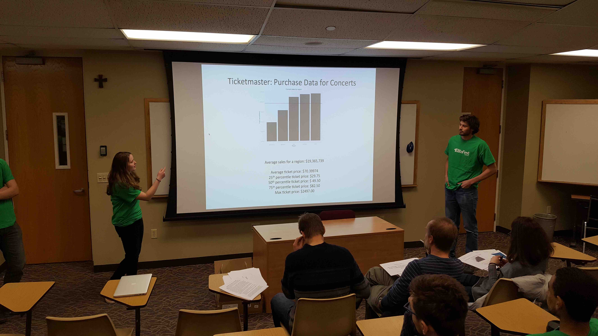

## 2016 Winners of "Best in Show"

## Sign-Up

If you are interested in participating in DataFest, please complete the 
following 
[survey](https://docs.google.com/forms/d/1bJ8UDBZxCcUK22Z0Ivt4tRgkoeXPQnCzq-4UN2oltn4/edit?usp=drive_web)
as soon as possible.

## What is DataFest?

**DataFest is an internationally coordinated undergraduate data analysis hackathon.**

Over the course of a weekend, teams of students have to make sense of a large, 
rich, and complex dataset. At the end of the weekend, students will present 
their results to a panel of judges from local business, academia, and 
government, and have the chance to win prizes. Previous data sources include the
LAPD, eHarmony.com, and Edmunds.com.

Participating colleges this year include Duke, The Five Colleges (UMass Amherst,
Smith, Amherst, Mount Holyoke, and Hampshire Colleges), Macalester, UC Berkeley,
The Ohio State University, Penn State University, and Vassar College.

Read a <a href="http://fivethirtyeight.com/datalab/the-students-most-likely-to-take-our-jobs/"
target="_blank">FiveThirtyEight.com article</a> on the 2014 edition.

## Event Information

* **What**: The inaugural 2016 DataFest Vermont 802
* **Who**: Any Middlebury student with data skills, regardless of discipline.
* **When**: Friday April 8th through Sunday April 10th.
* **Where**: Saint Michael's College in Burlington VT. Transportation,
accommodations, and food will be covered (most likely in their entirety).

## How do I sign up?

There will be an informational/sign up session

* **When**: Thursday March 24th at 5pm
* **Where**: Math Lounge on the third floor of Warner.

For more information, contact Prof. Albert Y. Kim <a href="mailto:aykim@middlebury.edu">aykim@middlebury.edu</a>.

## Sponsors

