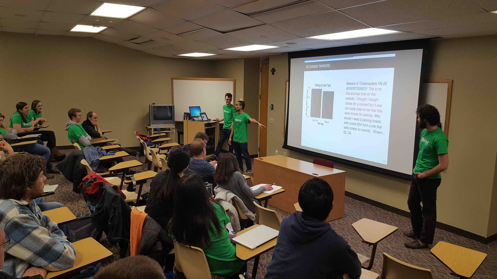
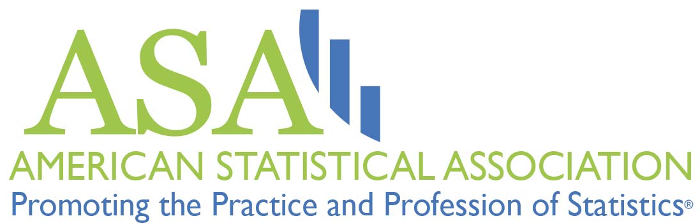

 

## What is DataFest?

#### DataFest is an internationally coordinated undergraduate data analysis hackathon

Over the course of a weekend, teams of students have to make sense of a large, 
rich, and complex dataset. At the end of the weekend, students will present 
their results to a panel of judges from local business, academia, and 
government, and have the chance to win prizes. Previous data sources include the
LAPD, eHarmony.com, Edmunds.com, and Ticketmaster. There are more <a target="_blank" class="page-link" 
href="https://docs.google.com/spreadsheets/d/12jMbdRrfTdKU9v_TJZl0xmVzChUkXDdqRUSvp-l7Si0/edit">participating
institutions</a> this year than ever!

#### DataFest 2016

* See <a target="_blank" class="page-link"
href="https://goo.gl/photos/UCRw6VLeGtLrPhLM6">photos</a> from the inaugural Vermont edition of
DataFest at Saint Michael's College in Colchester, VT.
* See the <a target="_blank" class="page-link" href="DataFest2016.html">DataFest 2016</a> page for last year's winners.

<!--
Read a <a
href="http://fivethirtyeight.com/datalab/the-students-most-likely-to-take-our-jobs/"
target="_blank">FiveThirtyEight.com article</a> on the 2014 edition.
-->

## Sign-Up Form & Slack Group

* Fill out this <a target="_blank" class="page-link" href="https://docs.google.com/forms/d/1tIZxRyG287lN_o1Er1_SW1zOn2-PYxOI2TV-hgNyLss/edit">Google Form</a>.
* We will then add you to the DataFest Vermont 2017 <a target="_blank" class="page-link" href="https://datafestvermont2017.slack.com">Slack Team</a>; bookmark the team page (or install the <a target="_blank" class="page-link" href="https://slack.com/downloads/">Slack app</a>) and check-in periodically for announcements leading up to the opening event on Friday April 7th 6pm at <a target="_blank" class="page-link" href="https://www.google.com/maps/place/Axinn+Center+at+Starr+Library,+Middlebury,+VT+05753/">Axinn Center 229</a>. 

## Event Information

* **Who**: Any student with data skills, regardless of discipline.
* **When**: Friday April 7th (evening) to Sunday April 9th (afternoon).
* **Where**: <a target="_blank" class="page-link" href="https://www.google.com/maps/place/Middlebury+College/">Middlebury College</a> in Middlebury, VT.

There will be information sessions:

* **@Middlebury College**: Thursday March 16th at 5pm in Warner Hall 203.

For more information, contact

* **@Middlebury College**: Prof. Albert Y. Kim <a href="mailto:aykim@middlebury.edu">aykim@middlebury.edu</a>
* **@Saint Michael's College**: Prof. Philip Yates <a href="mailto:pyates@smcvt.edu">pyates@smcvt.edu</a>
* **@University of Vermont**: Prof. Jeff Buzas <a href="mailto:jeff.buzas@uvm.edu">jeff.buzas@uvm.edu</a>
* **@Williams College**: Prof. Brianna Heggeseth <a href="mailto:bch2@williams.edu">bch2@williams.edu</a>

## Judges

We've received commitments from the following individuals to be judges: 

* Polly Mangan: <a target="_blank" class="page-link" href="https://www.linkedin.com/in/polly-ramsey-mangan-a0bb6090/">Data Scientist</a> at Dealer.com
* Beth Anderson: <a target="_blank" class="page-link" href="http://www.sevendaysvt.com/OffMessage/archives/2015/05/14/burlington-mayor-appoints-chief-innovation-officer">Chief Innovation Officer</a> for the City of Burlington VT
* Matt Landis: <a target="_blank" class="page-link" href="https://www.linkedin.com/in/matthewlandis/">Data Scientist</a> at ISciences
* Philip Yates: <a target="_blank" class="page-link" href="http://www.smcvt.edu/pages/get-to-know-us/faculty/yates-philip.aspx">Associate Professor of Statistics</a> at Saint Michael's College

## Sponsors

 

   
    

<!--

-->

