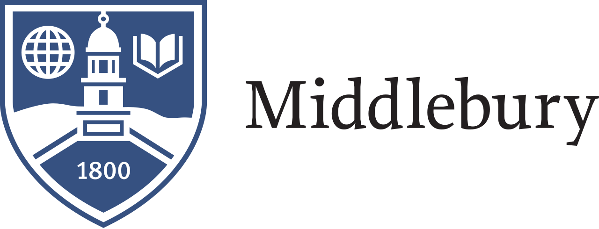

## What is DataFest?

**DataFest is an internationally coordinated undergraduate data analysis hackathon.**

Over the course of a weekend, teams of students have to make sense of a large, 
rich, and complex dataset. At the end of the weekend, students will present 
their results to a panel of judges from local business, academia, and 
government, and have the chance to win prizes. Previous data sources include the
LAPD, eHarmony.com, Edmunds.com, and Ticketmaster.

There are more participating colleges this year than ever! Click on this <a
target="_blank" class="page-link"
href="https://docs.google.com/spreadsheets/d/12jMbdRrfTdKU9v_TJZl0xmVzChUkXDdqRUSvp-l7Si0/edit">Google
Sheet</a> to see all the institutions that have signed up so far! Read a <a
href="http://fivethirtyeight.com/datalab/the-students-most-likely-to-take-our-jobs/"
target="_blank">FiveThirtyEight.com article</a> on the 2014 edition.

## Event Information

* **What**: 2017 DataFest Vermont.
* **Who**: Any student with data skills, irregardless of discipline.
* **When**: The evening of Friday April 7th to the afternoon of Sunday April 9th.
* **Where**: <a target="_blank" class="page-link" href="https://www.google.com/maps/place/Middlebury+College/">Middlebury College</a> in Middlebury, VT.
* **How do I sign up?** Fill out this <a target="_blank" class="page-link" href="https://docs.google.com/forms/d/1tIZxRyG287lN_o1Er1_SW1zOn2-PYxOI2TV-hgNyLss/edit">Google Form</a>.

For more information, contact

* **@Middlebury College**: Prof. Albert Y. Kim <a href="mailto:aykim@middlebury.edu">aykim@middlebury.edu</a>
* **@Saint Michael's College**: Prof. Philip Yates <a href="mailto:pyates@smcvt.edu">pyates@smcvt.edu</a>
* **@University of Vermont**: Prof. Jeff Buzas <a href="mailto:jeff.buzas@uvm.edu ">jeff.buzas@uvm.edu</a>

## Middlebury Students:

There will be an informational/sign up session:

* **When**: Thursday March 24th at 5pm
* **Where**: Math Lounge on the third floor of Warner.

## Sponsors

<!--

-->